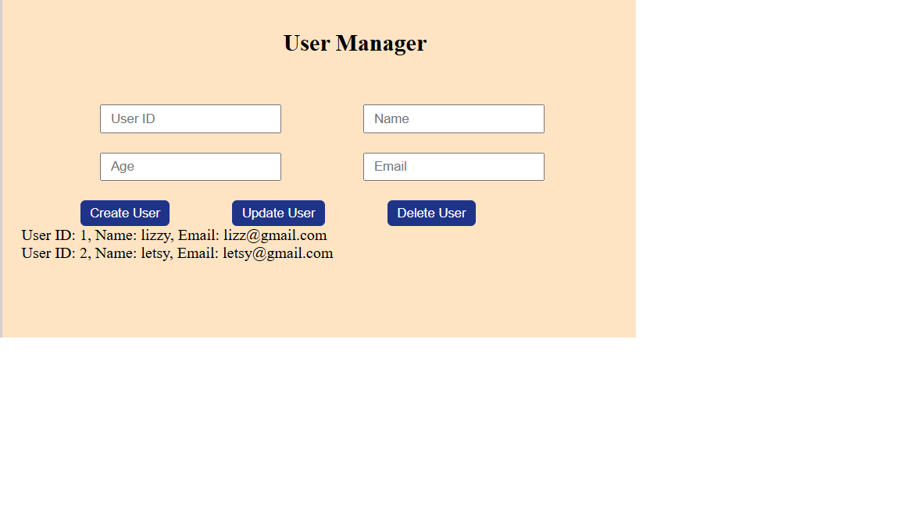
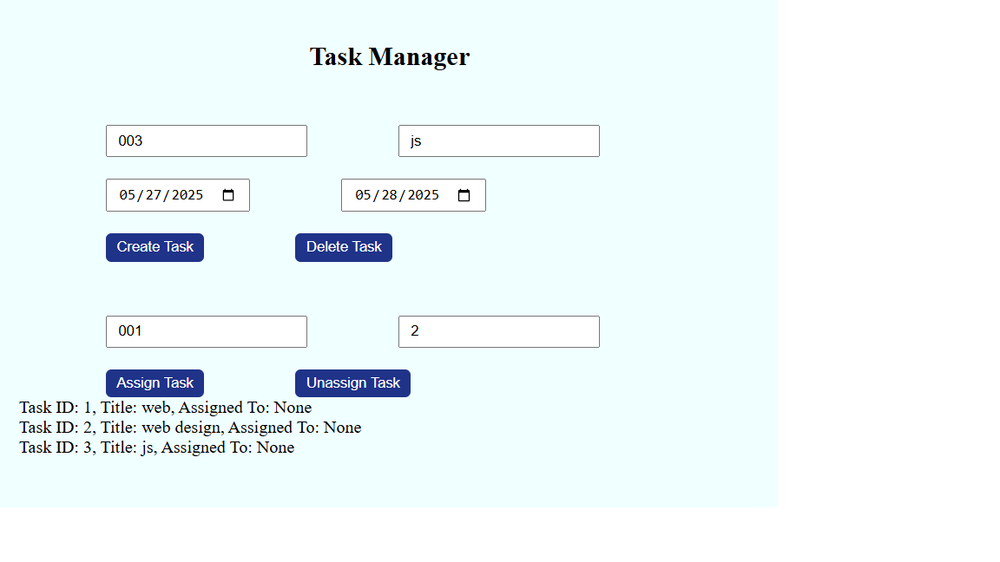

## Author
ELIZABETH NYARIKI

# Task Management System

## Features

-A user manager where one is able to create, update and delete users.

-A task manager where one is able to create and delete tasks.

-One can also assign tasks to users by entering the userid and taskid .

## Technologies Used

HTML

CSS

JavaScript

Typescript

## How to use

Start by configuring typescript in your machine by running thr following in Git bash:-

npm init -y

npm install typescript

## How to compile and run the code

To compile you run tsc src/index.ts

To run it: node dist/index.js

 
